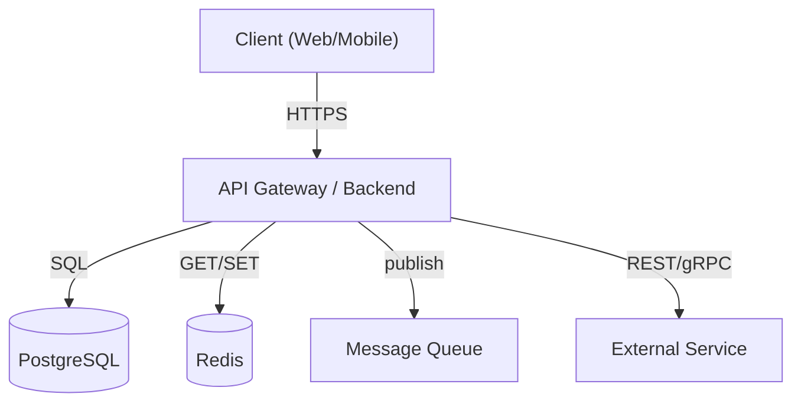
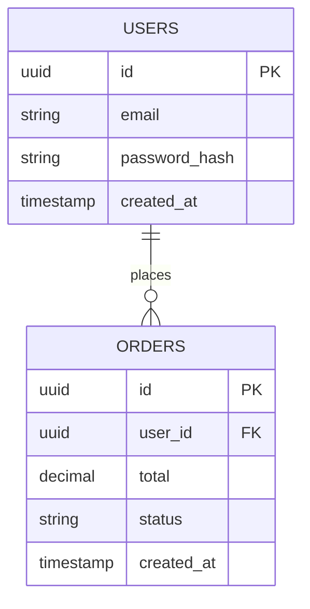
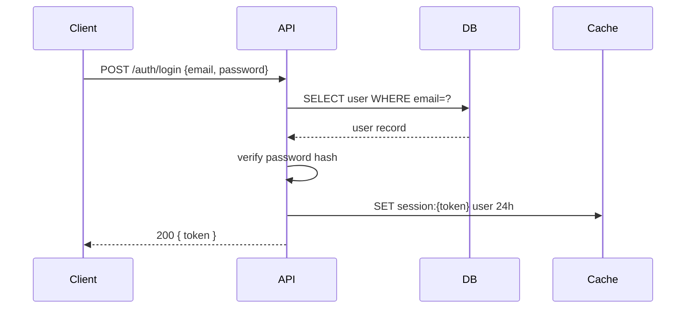

# Project Analysis for New Team Members

## Overview

**Core principle:** A good project analysis answers three questions for the newcomer: *What does this system do? How is it built? How does data flow through it?* Text alone is insufficient — use diagrams. Domain terms must be explained — assume nothing.

This skill turns any codebase into a structured onboarding document with architecture diagrams, data models, API inventory, and a glossary.

---

## Discovery Order

Work through these layers in sequence. Skip layers that don't apply (no DB? skip ER diagram. No Redis? note it's not used).

```
1. README + docs/          → Purpose, install, key concepts
2. Config files            → Tech stack, services, environment
3. Entry points            → How the app starts, what it exposes
4. API layer               → Routes, endpoints, handlers
5. Database layer          → Models, migrations, schemas
6. Cache/storage layer     → Redis keys, session, file storage
7. External services       → Env vars, HTTP clients, SDKs
8. Domain terminology      → Business terms used in code/docs
```

**Files to prioritize:**
| Look for | What it reveals |
|---|---|
| `README.md`, `docs/`, `wiki/` | Purpose, architecture decisions, setup |
| `docker-compose.yml`, `docker-compose.yaml` | Services, dependencies, ports |
| `.env.example`, `.env.sample`, `config.yaml` | External services, feature flags |
| `package.json`, `go.mod`, `pom.xml`, `requirements.txt` | Tech stack and dependencies |
| `Makefile`, `Dockerfile`, `*.sh` | Build process, deployment |
| `migrations/`, `db/schema.*`, `prisma/schema.prisma` | Database schema |
| `routes/`, `handlers/`, `controllers/`, `api/` | API endpoints |
| `*redis*`, `*cache*`, `*session*` files | Cache layer |

---

## Required Output Sections

Produce ALL applicable sections. Never skip a section without explicitly stating "N/A — this project has no [X]."

### 1. Project Purpose & Objectives

- What problem does this solve? For whom?
- What is the system's primary responsibility?
- What are the current active development goals?

### 2. Tech Stack

Table format:

| Layer | Technology | Purpose |
|---|---|---|
| Language | Go / Node.js / Python | ... |
| Framework | Gin / Express / FastAPI | ... |
| Database | PostgreSQL / MongoDB | ... |
| Cache | Redis / Memcached | ... |
| Message Queue | Kafka / RabbitMQ | ... |
| Infrastructure | Docker / Kubernetes | ... |

### 3. Architecture Overview

**Always produce a mermaid architecture diagram.** Use `graph TD` or `C4Context` style. Show:
- Major components/services
- How they communicate (sync vs async)
- External systems at the boundary



For microservices, show all services and their communication patterns.

### 4. Project Structure

Directory tree with explanation of each top-level folder. Not just names — explain the *role* of each:

```
src/
├── api/          ← HTTP handlers and route definitions
├── domain/       ← Core business logic, entities (no framework deps)
├── infra/        ← Database, cache, external service adapters
├── config/       ← App configuration loading
└── cmd/          ← Entry points (main.go, server.go)
```

### 5. API Reference

For each endpoint group, list:
- Method + path
- What it does
- Auth required?
- Key request/response fields

Example:
```
POST /api/v1/users/register
  → Creates new user account
  → No auth required
  → Body: { email, password, name }
  → Returns: { userId, token }

GET /api/v1/users/:id
  → Returns user profile
  → Requires: Bearer token
  → Returns: { id, email, name, createdAt }
```

If an OpenAPI/Swagger spec exists, reference its location. Still summarize the key endpoint groups.

### 6. Database Design

**Always produce a mermaid ER diagram** for relational databases. For document databases, show the collection schema.



After the diagram, document each table/collection:
- Column name, type, nullable, description
- Indexes and why they exist
- Foreign key relationships

### 7. Cache Layer (Redis / Memcached)

If a cache layer exists, document:

| Key Pattern | Example | TTL | Cached Data | Why cached |
|---|---|---|---|---|
| `user:session:{token}` | `user:session:abc123` | 24h | User session object | Avoid DB hit on every request |
| `product:list:page:{n}` | `product:list:page:1` | 5m | Paginated product list | Heavy query, frequently read |

If no cache: state "This project does not use a cache layer."

### 8. External Services & Integrations

List every external dependency:

| Service | Type | What it does | Config key |
|---|---|---|---|
| SendGrid | Email | Transactional emails | `SENDGRID_API_KEY` |
| Stripe | Payment | Card processing | `STRIPE_SECRET_KEY` |
| S3 | Object storage | User file uploads | `AWS_BUCKET_NAME` |
| Google OAuth | Auth | Social login | `GOOGLE_CLIENT_ID` |

**How to find these:** Search `.env.example`, `config.*`, and look for `http.NewClient`, SDK instantiation, or environment variable reads.

### 9. Key User Flows (Sequence Diagrams)

Pick **2–3 core user journeys** and diagram them. Examples: login flow, purchase flow, data processing pipeline.



### 10. Deployment & Infrastructure

- How is the app packaged? (Docker, binary, JAR)
- How is it deployed? (Kubernetes, Compose, bare metal)
- What environments exist? (dev, staging, production)
- How to run locally?

```bash
# Local setup steps
docker-compose up -d     # Start services
make migrate             # Run DB migrations
make run                 # Start app
```

### 11. Glossary

**Always build a glossary.** Include:
1. **Domain/business terms** used in the codebase (e.g., "Ledger", "SKU", "Tenant", "Claim")
2. **Technical terms** that a junior dev may not know (e.g., "CQRS", "idempotency key", "saga pattern")
3. **Project-specific abbreviations** (e.g., "SLA", "ORM", "DTO")

Format:
| Term | Plain-English Explanation |
|---|---|
| **Tenant** | A customer organization in a multi-tenant system. Each tenant has isolated data. |
| **Idempotency key** | A unique ID sent with a request so that retrying the same request doesn't cause duplicate effects. |
| **CQRS** | Command Query Responsibility Segregation — separates read and write operations into different models. |

---

## Common Failures to Avoid

| Failure | Fix |
|---|---|
| Describing architecture in text only | Always add a mermaid diagram |
| Listing table names without columns | Document each field: name, type, description |
| Ignoring `.env.example` | This reveals ALL external dependencies |
| Writing for developers, not newcomers | Explain WHY, not just what. Define all terms. |
| Stopping at structure without flows | Add sequence diagrams for 2-3 key journeys |
| Skipping Redis key patterns | Search for `.Set(`, `.Get(`, `redis.NewClient` usages |
| Generic "N/A" without checking | Search the codebase before skipping any section |

---

## Quick Reference Checklist

Before declaring the analysis complete:

- [ ] Purpose section answers "what problem does this solve?"
- [ ] Tech stack table includes all major dependencies
- [ ] Architecture diagram uses mermaid (not just text)
- [ ] API endpoints listed with method, path, auth, key fields
- [ ] ER diagram or collection schema shown for all databases
- [ ] Cache key patterns documented (or "N/A" confirmed by code search)
- [ ] External services table populated from .env.example / config
- [ ] At least 2 sequence diagrams for key user flows
- [ ] Deployment section includes how-to-run-locally steps
- [ ] Glossary covers domain terms AND technical acronyms used in this project
