# Product Engineering Kickoff

## Purpose

Use this skill to prepare a product/engineering kickoff document for a technology product or major technical initiative.

The goal is to create a clear, reusable document that can be presented and maintained in:

* Notion
* Confluence
* Markdown
* GitHub
* GitLab
* Internal engineering documentation

The kickoff document should help Product, Engineering, Design, Platform, Infrastructure, Security, Data, AI, Operations, and other involved teams build a shared understanding of:

* Why the product exists
* What problem it solves
* Who uses it
* What is in scope and out of scope
* How the product works
* How the technical architecture works
* What each team owns
* Where teams depend on each other
* What contracts/interfaces need to be agreed
* How the product will be delivered
* What risks and unresolved questions exist
* What decisions and actions are required after kickoff

This skill should work for any technology product, including:

* SaaS products
* Internal platforms
* Developer platforms
* AI/agent products
* Infrastructure products
* APIs
* Data platforms
* Security products
* Mobile/web applications
* Enterprise integrations
* New technical capabilities inside an existing product

---

# Core Principle

A kickoff document should follow this narrative:

**Problem → User → Product → Experience → System → Ownership → Dependencies → Delivery → Risks → Actions**

Do not start with detailed architecture.

Every reader should first understand why the product exists before being asked to understand how it is implemented.

The document should progressively move from product context into engineering details.

---

# Primary Output Format

The default output is a structured document, not a slide deck.

Optimize for asynchronous reading and discussion.

The document should be useful:

* Before the kickoff meeting
* During the kickoff meeting
* After the kickoff as a source of truth
* During implementation
* During onboarding of new contributors
* When revisiting architecture or ownership decisions

Do not write the document as presentation notes.

Do not use language such as:

* "On this slide"
* "The next slide shows"
* "Presenter should explain"
* "Speaker notes"
* "Visual for this slide"

Instead, write the content directly as documentation.

---

# Recommended Document Structure

Use approximately this structure unless the project requires something different.

```markdown
# [Product / Project Name]

## 1. Executive Summary
## 2. Context & Problem
## 3. Goals & Non-Goals
## 4. Users & Key Use Cases
## 5. Product Flow
## 6. System Architecture
## 7. Components & Responsibilities
## 8. Team Ownership
## 9. Cross-Team Dependencies
## 10. Technical Contracts
## 11. MVP & Future Scope
## 12. Delivery Plan
## 13. Risks
## 14. Open Questions
## 15. Decisions
## 16. Action Items
```

Do not mechanically include every section if it adds no value.

For small initiatives, use the compact structure defined later in this skill.

---

# Documentation Style

The kickoff should be easy to scan.

Prefer:

* Clear headings
* Short paragraphs
* Bullet points
* Tables
* Mermaid diagrams
* Callouts
* Explicit status labels
* Decision records
* Action tables

Avoid:

* Long walls of text
* Marketing language
* Excessive background information
* Detailed implementation documentation that does not affect cross-team understanding

The document should be understandable by someone outside the team that created it.

---

# Diagram Standard

## Mermaid Is Mandatory

All diagrams produced by this skill MUST use Mermaid.

Do not use:

* ASCII diagrams
* Unicode box diagrams
* Manually aligned text diagrams
* Plain-text arrows as a substitute for diagrams
* Pseudo-diagrams made from indentation

Use Mermaid for:

* Product flows
* User journeys
* Sequence diagrams
* Architecture diagrams
* System context diagrams
* Component diagrams
* Cross-team dependencies
* Integration flows
* Trust boundaries
* Data flows
* Delivery milestones
* Roadmaps
* State transitions
* Decision flows
* Infrastructure topology

Simple inline transformations such as:

`Current State → Product → Desired Outcome`

are allowed inside normal prose.

If something is intended to function as a diagram, use Mermaid.

---

# Mermaid Compatibility

Prefer Mermaid syntax that works across common Markdown/documentation tools.

Avoid unnecessary experimental Mermaid features.

Keep diagrams portable across:

* GitHub Markdown
* GitLab
* Notion environments that support Mermaid
* Confluence environments/plugins that support Mermaid
* Markdown documentation generators

If a target platform has Mermaid limitations, keep the syntax conservative.

---

# Mermaid Selection Guide

## Flowchart

Use for:

* Product flow
* User journey
* High-level architecture
* Dependencies
* System boundaries
* Delivery stages
* Decision trees

Example:

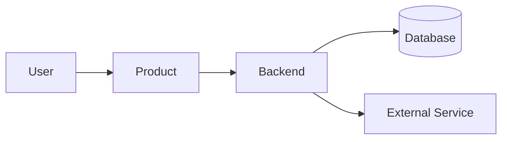

---

## Sequence Diagram

Use when the order of interaction matters.

Use for:

* API interactions
* Authentication
* User-to-system flows
* Agent workflows
* Cross-service requests
* Integration behavior

Example:

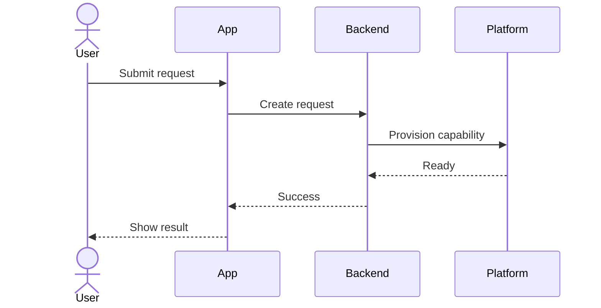

---

## State Diagram

Use when an entity transitions between states.

Example:

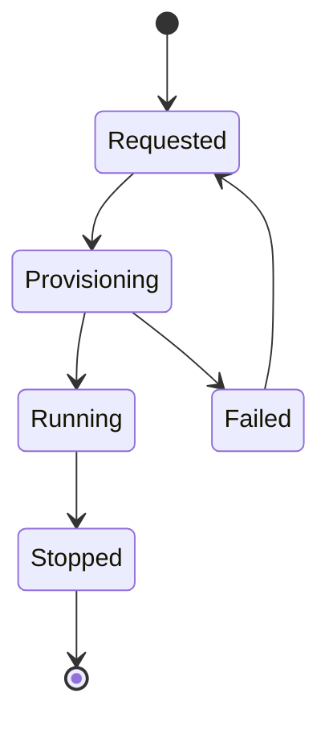

---

## Timeline

Use when dates or chronological events are important.

Example:

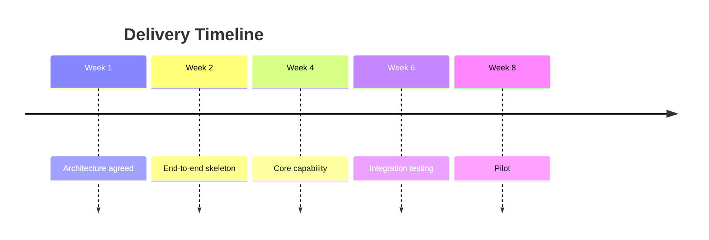

Use a `flowchart` instead when milestone dependency matters more than exact calendar timing.

---

## Entity Relationship Diagram

Use only when data relationships are important to cross-team understanding.

Example:

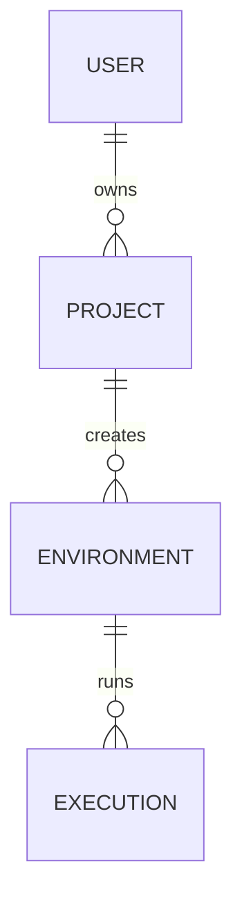

Do not include an ER diagram merely because the product has a database.

---

# Mermaid Design Rules

## Keep the First Architecture Diagram Simple

The first system diagram should normally contain approximately 5–8 major nodes.

Its purpose is orientation.

More detailed diagrams can follow later if needed.

---

## Use Meaningful Node Names

Bad:

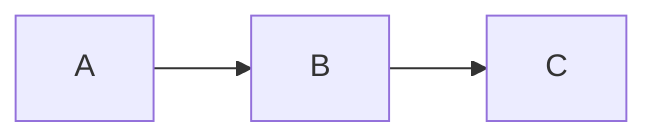

Better:

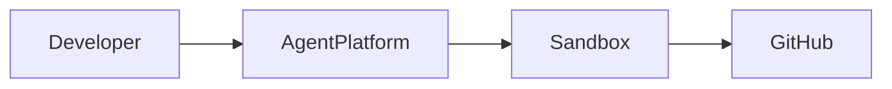

---

## Label Important Relationships

Prefer:

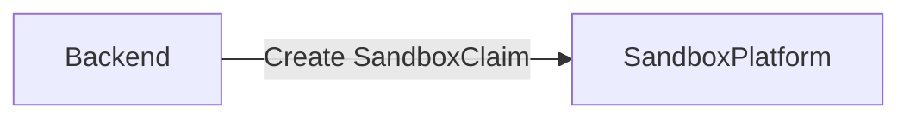

over:

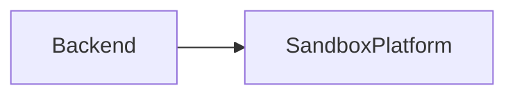

when the interaction itself matters.

---

## Use Subgraphs for Boundaries

Use Mermaid `subgraph` to show:

* Team ownership
* Product boundaries
* Platform boundaries
* Trust boundaries
* Internal vs external systems
* Deployment boundaries

Example:

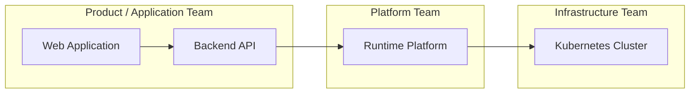

---

## Show External Systems Explicitly

Example:

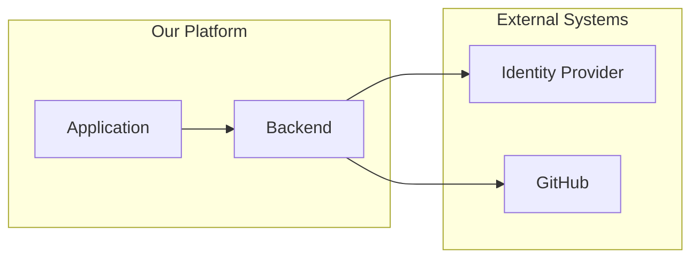

---

## Avoid Decorative Styling

Do not spend effort on Mermaid colors, themes, or custom CSS unless explicitly requested.

Optimize for:

* Readability
* Compatibility
* Maintainability
* Easy editing by other engineers

---

# When to Use This Skill

Use this skill when the user asks to:

* Kick off a new product
* Kick off a technical project
* Prepare a cross-team kickoff
* Create a kickoff document
* Explain a product to engineering teams
* Explain architecture to other teams
* Align several teams around a technical initiative
* Define ownership
* Define dependencies
* Prepare an MVP delivery plan
* Introduce a new technical platform
* Explain how a system works
* Prepare architecture alignment documentation
* Create a Notion page
* Create a Confluence page
* Create Markdown documentation for a project kickoff

Also use it when the user provides raw project information and asks to:

* Organize it
* Turn it into a kickoff
* Structure the project
* Summarize it for other teams
* Document architecture
* Prepare cross-team alignment material

---

# Expected Inputs

Gather as much of the following information as is available.

Do not block execution if some information is missing.

## Product Context

* Product/project name
* One-line description
* Background
* Problem being solved
* Why now
* Target users
* Existing workflow
* Desired workflow

## Scope

* Goals
* Non-goals
* MVP scope
* Future scope
* Success metrics

## Product Experience

* Main use cases
* User journey
* Important workflows
* UI or interaction model

## Technical Context

* Existing architecture
* Proposed architecture
* Major components
* Services
* APIs
* Data stores
* External integrations
* Authentication/authorization
* Infrastructure
* Networking
* Security requirements
* Observability
* AI/model dependencies if applicable

## Organization

* Teams involved
* PICs
* Owners
* Consumers
* External partners
* Approvers

## Delivery

* Milestones
* Dates if known
* Dependencies
* Risks
* Open questions
* Rollout approach

---

# Missing Information Policy

Do not force the user to provide every field.

Infer structure from available context.

When information is missing:

1. Mark it as `TBD`, `Open Question`, or `To Confirm`.
2. Do not invent business decisions.
3. Do not invent team ownership.
4. Do not invent API contracts.
5. Do not invent deadlines.
6. Highlight missing information that could block execution.

Only ask questions when the missing information fundamentally prevents a useful kickoff document from being produced.

Otherwise, produce the best possible draft and clearly identify the gaps.

---

# Status Vocabulary

Use consistent status labels throughout the document.

Prefer:

* **Confirmed** — agreed and considered current
* **Proposed** — recommended but not yet agreed
* **TBD** — not yet determined
* **Blocked** — cannot proceed because of an unresolved dependency
* **Open** — requires follow-up
* **Deprecated** — previous decision no longer used

Do not represent proposals as decisions.

---

# Workflow

## Step 1 — Understand the Product

Reduce the initiative into a simple model.

### Product

**[Product Name]**

### One-line description

> [What the product does, for whom, and the main value it creates.]

Use this formula when useful:

> `[Product] helps [target user] achieve [outcome] by [core mechanism].`

Example:

> Agent Sandbox provides isolated runtime environments for AI agents so they can safely execute code and tools without accessing the host platform directly.

---

# Step 2 — Write the Executive Summary

The first section should let someone understand the initiative in approximately one minute.

Use:

```markdown
## Executive Summary

**Product:** [name]

**One-line description:**  
[description]

**Target users:**  
[users]

**Problem:**  
[problem]

**Proposed solution:**  
[solution]

**Current status:**  
[status]

**Kickoff objective:**  
[what teams need to align on]
```

Keep this section concise.

Do not place deep architecture here.

---

# Step 3 — Define the Problem

Explain the current state before introducing the solution.

Use:

```markdown
## Context & Problem

### Current State

Today, users/teams currently:

1. ...
2. ...
3. ...

### Problems

This creates:

- ...
- ...
- ...

### Desired State

...
```

If a visual transformation helps:

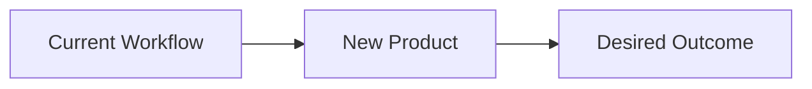

Focus on observable problems.

Avoid vague statements such as:

* Improve productivity
* Use AI
* Modernize architecture
* Improve developer experience

unless they are followed by concrete explanation.

---

# Step 4 — Define Goals and Non-Goals

Use:

| Goals | Non-Goals |
| ----- | --------- |
| Goal  | Non-goal  |
| Goal  | Non-goal  |
| Goal  | Non-goal  |

Goals describe what the initiative must achieve.

Non-goals describe things intentionally excluded from the current scope.

Non-goals are especially important in cross-team projects because they prevent assumptions from becoming scope.

---

# Step 5 — Identify Users and Use Cases

Identify the actors interacting with the product.

Examples:

* End user
* Developer
* Administrator
* Operations team
* External service
* AI agent
* Internal product
* Customer application

Use a table where useful:

| Actor         | Need | Key Actions | Outcome |
| ------------- | ---- | ----------- | ------- |
| Developer     | ...  | ...         | ...     |
| Administrator | ...  | ...         | ...     |

Focus on the most important 2–5 use cases.

Avoid cataloguing every theoretical use case.

---

# Step 6 — Build the Product Flow

Explain the product from the user's perspective before introducing implementation architecture.

Example:

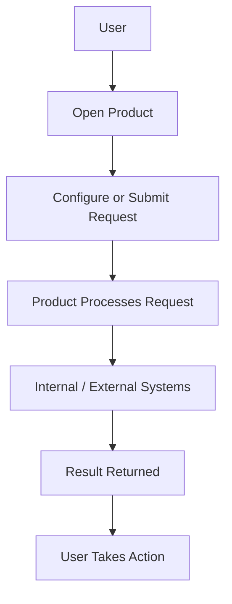

For multi-system interaction, prefer a sequence diagram.

Example:

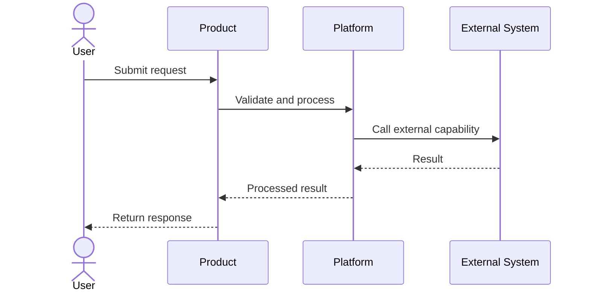

Do not mix the product journey with implementation-level details unless they are necessary to understand the behavior.

---

# Step 7 — Explain the System Architecture

After the product flow is understood, introduce the high-level system architecture.

Example:

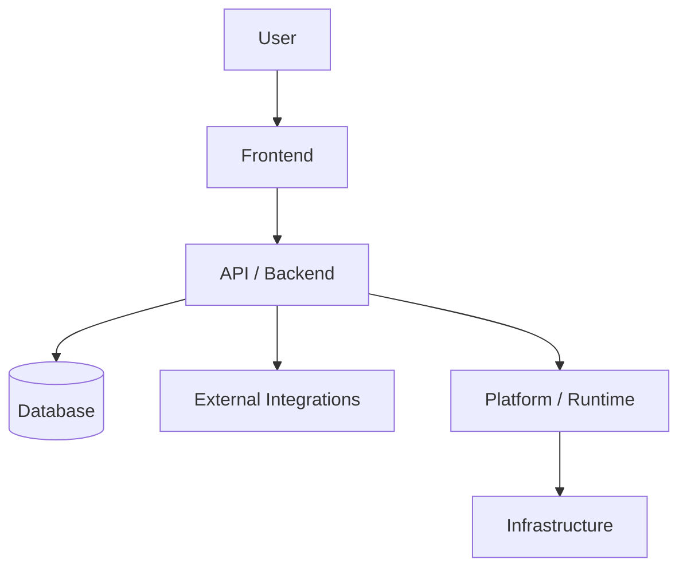

The first architecture view should answer:

* What are the main components?
* How does information move?
* Where are the major boundaries?
* Which systems are external?
* Which teams own which areas?

Do not show implementation details that do not affect cross-team understanding.

---

# Step 8 — Break Down Components and Responsibilities

For important components, use a table.

| Component   | Purpose | Responsibilities | Does Not Own | Owner  |
| ----------- | ------- | ---------------- | ------------ | ------ |
| Component A | ...     | ...              | ...          | Team A |

For components that require more explanation:

```markdown
### Component: [Name]

**Purpose**

...

**Responsibilities**

- ...
- ...

**Does not own**

- ...

**Depends on**

- ...

**Consumed by**

- ...

**Owner**

...
```

Architecture diagrams should not be the only place where responsibilities are described.

---

# Step 9 — Define Team Ownership

Create a responsibility map.

| Area           | Owner         | Responsibility                      | Needs From Others        |
| -------------- | ------------- | ----------------------------------- | ------------------------ |
| Product        | Product       | Scope, requirements, prioritization | Engineering feasibility  |
| Frontend       | App Team      | User-facing application             | Backend APIs             |
| Backend        | Backend Team  | Business logic/API                  | Platform/infrastructure  |
| Platform       | Platform Team | Runtime/platform capability         | Workload requirements    |
| Infrastructure | Infra         | Cluster/network/storage             | Capacity requirements    |
| Security       | Security      | Security review/policy              | Architecture information |
| Data           | Data Team     | Data source/pipeline                | Schema requirements      |

When ownership boundaries are important, use Mermaid.

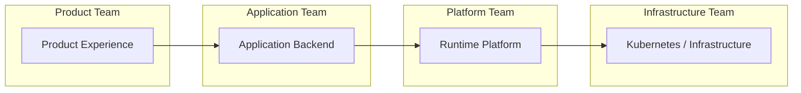

Prefer explicit ownership over vague statements such as:

> Engineering owns this.

---

# Step 10 — Identify Cross-Team Dependencies

Cross-team problems frequently occur at interfaces.

For each important dependency, document the contract explicitly.

Use:

```markdown
### Dependency: [Dependency Name]

**Provider / Owner:**  
[team]

**Consumer:**  
[team/product]

**Capability needed**

- ...
- ...

**Interface**

- API / Event / Queue / SDK / Network / Identity / Human process

**Required by**

[milestone]

**Status**

Confirmed / Proposed / TBD / Blocked

**Open Questions**

- ...
- ...
```

For multiple dependencies, include a Mermaid overview.

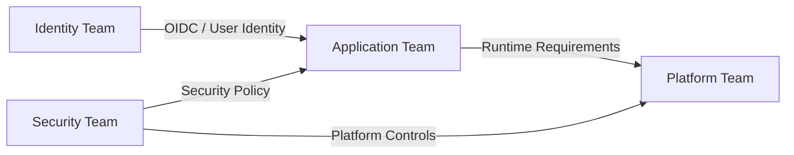

---

# Step 11 — Identify Technical Contracts

Explicitly document contracts that teams must agree on.

## API Contract

Include:

* Endpoint or interface
* Request
* Response
* Error model
* Authentication
* Authorization
* Versioning
* Ownership

## Data Contract

Include:

* Schema
* Source of truth
* Producer
* Consumer
* Retention
* Consistency model
* Data sensitivity

## Event Contract

Include:

* Topic/event
* Producer
* Consumer
* Payload
* Delivery semantics
* Retry behavior
* Ordering requirements

## Infrastructure Contract

Include:

* Runtime
* CPU
* Memory
* Storage
* Network
* Availability
* Scaling expectations
* Deployment ownership

## Security Contract

Include:

* Identity
* Authentication
* Authorization
* Secrets
* Trust boundaries
* Data classification
* Audit requirements

## AI Contract

If AI, agents, or models are involved, include:

* Model provider
* Supported models
* Context/token limits
* Tool access
* Sandbox policy
* Data privacy
* Prompt/data retention
* Fallback behavior
* Cost controls
* Model ownership

When interaction order matters, use Mermaid.

Example:

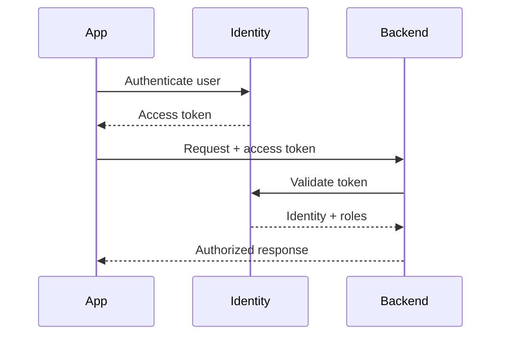

---

# Step 12 — Define MVP and Future Scope

Avoid describing the long-term vision as the first release.

Separate clearly:

## MVP

Must exist to prove the end-to-end product.

Typical examples:

* Core workflow
* Authentication
* Main integration
* Basic UI/API
* Minimum observability
* Basic failure handling

## Phase 2

Capabilities to add after MVP validation.

Typical examples:

* More automation
* Analytics
* Additional integrations
* Better administration
* Self-service capability

## Future

Potential longer-term direction.

Typical examples:

* Multi-region
* Advanced governance
* Marketplace/ecosystem
* Advanced optimization
* Large-scale enterprise controls

When useful:

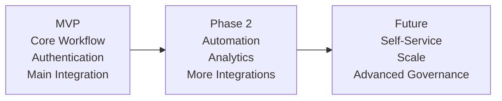

The MVP should represent an end-to-end usable slice, not disconnected technical pieces.

---

# Step 13 — Build the Delivery Plan

Prefer capability milestones over arbitrary implementation tasks.

Example:

```mermaid
flowchart LR
    Scope[Problem / Scope Agreed]
    Architecture[Architecture Agreed]
    Contracts[Interfaces / Contracts Agreed]
    Skeleton[End-to-End Skeleton]
    Core[Core Capability Complete]
    Integration[Cross-Team Integration]
    Testing[Internal Testing]
    Pilot[Pilot]
    Production[Production Rollout]

    Scope --> Architecture
    Architecture --> Contracts
    Contracts --> Skeleton
    Skeleton --> Core
    Core --> Integration
    Integration --> Testing
    Testing --> Pilot
    Pilot --> Production
```

Use a milestone table:

| Milestone | Outcome | Owner | Dependencies | Exit Criteria | Status |
| --------- | ------- | ----- | ------------ | ------------- | ------ |

Milestones should describe observable outcomes.

Bad:

> Finish backend.

Better:

> Primary workflow can complete end-to-end in staging.

---

# Step 14 — Identify Risks

Separate risks by category where useful.

## Product

* User value unclear
* Requirements changing
* Adoption risk

## Engineering

* Unknown technical feasibility
* Performance
* Reliability
* Scalability

## Integration

* External API dependency
* Legacy system limitation
* Contract instability

## Infrastructure

* Capacity
* Networking
* Runtime compatibility
* Environment readiness

## Security

* Permission model
* Sensitive data
* Secret management
* Compliance

## Delivery

* Cross-team dependency
* Ownership gap
* Timeline assumptions

Use:

| Risk | Impact | Probability | Mitigation / Investigation | Owner | Status |
| ---- | ------ | ----------- | -------------------------- | ----- | ------ |

Do not invent probability estimates if none are known.

---

# Step 15 — Capture Open Questions

Do not hide unresolved issues.

Use:

| Question | Why It Matters | Type | Owner | Needed By | Status |
| -------- | -------------- | ---- | ----- | --------- | ------ |

Possible types:

* Product
* Technical
* Security
* Infrastructure
* Ownership
* Dependency
* Delivery

Open questions are part of the kickoff artifact, not an appendix to ignore.

---

# Step 16 — Record Decisions

The kickoff document should act as a source of truth for decisions.

Use:

## Confirmed Decisions

| Decision | Rationale | Owner | Date |
| -------- | --------- | ----- | ---- |

## Proposed Decisions

| Proposal | Why | Decision Owner | Needed By |
| -------- | --- | -------------- | --------- |

## Deferred Decisions

| Decision | Why Deferred | Revisit When |
| -------- | ------------ | ------------ |

Do not mix confirmed and proposed decisions.

---

# Step 17 — End With Action Items

Every kickoff should produce executable follow-up.

Use:

| Action                   | PIC      | Due   | Status |
| ------------------------ | -------- | ----- | ------ |
| Confirm API contract     | Team A   | DD/MM | Open   |
| Provision environment    | Platform | DD/MM | Open   |
| Complete security review | Security | DD/MM | Open   |

Each important action should have:

* A clear outcome
* One primary owner
* A due date if known
* A status

Avoid vague actions such as:

> Discuss security.

Prefer:

> Security team to confirm whether workload tokens can be injected into warm sandbox pods without violating the sandbox policy.

---

# Recommended Full Document Template

Use this as the default Markdown structure.

````markdown
# [Product / Project Name]

> One-line description of the product.

**Status:** Proposed / Confirmed / In Progress  
**Owner:** [team/person]  
**Last Updated:** [date]

---

## 1. Executive Summary

**Problem:**  
...

**Users:**  
...

**Proposed Solution:**  
...

**Expected Outcome:**  
...

**Kickoff Objective:**  
...

---

## 2. Context & Problem

### Current State

...

### Problems

- ...
- ...

### Desired State

...

```mermaid
flowchart LR
    Current[Current State] --> Product[Product]
    Product --> Desired[Desired Outcome]
````

---

## 3. Goals & Non-Goals

| Goals | Non-Goals |
| ----- | --------- |
| ...   | ...       |

---

## 4. Users & Key Use Cases

| Actor | Need | Key Actions | Outcome |
| ----- | ---- | ----------- | ------- |

---

## 5. Product Flow

```mermaid
...
```

### Flow Explanation

...

---

## 6. System Architecture

```mermaid
...
```

### Architecture Notes

* ...
* ...

---

## 7. Components & Responsibilities

| Component | Purpose | Responsibility | Owner |
| --------- | ------- | -------------- | ----- |

---

## 8. Team Ownership

| Area | Owner | Responsibility | Needs From Others |
| ---- | ----- | -------------- | ----------------- |

---

## 9. Cross-Team Dependencies

```mermaid
...
```

| Dependency | Provider | Consumer | Interface | Needed By | Status |
| ---------- | -------- | -------- | --------- | --------- | ------ |

---

## 10. Technical Contracts

### [Contract Name]

**Provider:**
...

**Consumer:**
...

**Interface:**
...

**Status:**
...

**Open Questions:**

* ...
* ...

---

## 11. MVP & Future Scope

### MVP

* ...
* ...

### Phase 2

* ...
* ...

### Future

* ...
* ...

---

## 12. Delivery Plan

```mermaid
...
```

| Milestone | Outcome | Owner | Dependencies | Exit Criteria | Status |
| --------- | ------- | ----- | ------------ | ------------- | ------ |

---

## 13. Risks

| Risk | Impact | Mitigation | Owner | Status |
| ---- | ------ | ---------- | ----- | ------ |

---

## 14. Open Questions

| Question | Why It Matters | Owner | Needed By | Status |
| -------- | -------------- | ----- | --------- | ------ |

---

## 15. Decisions

### Confirmed

| Decision | Rationale | Owner |
| -------- | --------- | ----- |

### Proposed

| Proposal | Rationale | Decision Owner |
| -------- | --------- | -------------- |

---

## 16. Action Items

| Action | PIC | Due | Status |
| ------ | --- | --- | ------ |

---

## References

* PRD
* Architecture documents
* API specifications
* Related issues
* Related repositories

````

---

# Compact Kickoff Template

For smaller initiatives, use:

```markdown
# [Project Name]

## Summary
## Problem & Goals
## Product Flow
## Architecture
## Ownership & Dependencies
## Delivery & Risks
## Decisions & Actions
````

This compact version should still answer:

* Why are we doing this?
* Who is it for?
* What are we building?
* How does it work?
* Who owns what?
* What depends on whom?
* What happens next?

---

# Output Modes

## Mode: Analyze

Use when the user provides raw project information and wants gaps or feedback.

Return:

1. Product understanding
2. Missing information
3. Cross-team dependencies
4. Risks
5. Open questions
6. Recommended document structure

---

## Mode: Draft Kickoff

Create the complete kickoff document.

Default to Markdown-compatible syntax.

Use Mermaid for every diagram.

---

## Mode: Update Existing Kickoff

When an existing document is provided:

1. Preserve useful existing content.
2. Fix unclear structure.
3. Add missing sections where they improve alignment.
4. Update diagrams using Mermaid.
5. Identify conflicting information.
6. Distinguish obsolete decisions from current decisions.
7. Keep terminology consistent.

Do not rewrite merely for stylistic reasons when the existing wording is already clear.

---

## Mode: Architecture Alignment

Focus on:

* Context
* Product/system boundaries
* Components
* Interfaces
* Ownership
* Dependencies
* Non-functional requirements
* Security boundaries
* Open technical decisions

Use Mermaid for all architecture and interaction diagrams.

---

## Mode: Cross-Team Alignment

Focus on:

* Team ownership
* Provider/consumer relationships
* APIs and contracts
* Dependencies
* Required decisions
* Delivery sequencing
* Blockers
* Action items

---

## Mode: Executive Summary

Create a shorter document focused on:

* Problem
* Users
* Value
* Scope
* High-level architecture
* Major teams
* Delivery
* Risks
* Decisions required

Avoid unnecessary implementation details.

---

# Writing Rules

## 1. Optimize for Asynchronous Reading

A reader should understand the document without someone presenting it live.

Important context must exist in the document itself.

Do not depend on verbal explanation.

---

## 2. Use Progressive Disclosure

Start broad.

Then progressively introduce:

1. Product context
2. Product flow
3. High-level architecture
4. Component responsibilities
5. Detailed contracts

Do not put all technical detail at the top.

---

## 3. One Section, One Purpose

Each section should answer a specific question.

For example:

**Context & Problem**

> Why are we doing this?

**Goals & Non-Goals**

> What are we trying to achieve, and what are we intentionally not doing?

**Architecture**

> How does the system work?

**Ownership**

> Who owns each part?

**Dependencies**

> What do teams need from each other?

**Delivery**

> How do we get from here to usable product?

---

## 4. Explain Before Naming

Do not assume readers know internal terminology.

Instead of:

> MCP Gateway

prefer:

> **MCP Gateway** — the central gateway through which agents access approved tools.

The first occurrence of an internal concept should usually include a short explanation.

---

## 5. Separate Product Flow From Technical Flow

Do not combine user behavior and infrastructure implementation in one overloaded diagram.

Example:

### Product Flow

```mermaid
flowchart LR
    User --> CreateAgent[Create Agent]
    CreateAgent --> Ready[Agent Ready]
```

### Technical Flow

```mermaid
sequenceDiagram
    participant Backend
    participant Kubernetes
    participant Operator

    Backend->>Kubernetes: Create SandboxClaim
    Kubernetes->>Operator: Reconcile
    Operator->>Kubernetes: Bind sandbox
```

---

## 6. Separate Overview From Detail

A complex product may need multiple architecture levels.

Recommended order:

### System Context

Shows the product and external actors.

### High-Level Architecture

Shows major components.

### Critical Flow

Shows one important interaction.

### Detailed Component Design

Include only when cross-team understanding requires it.

Do not make the first diagram an implementation dump.

---

## 7. Prefer Tables for Structured Comparison

Use tables for:

* Ownership
* Goals/non-goals
* Dependencies
* Risks
* Open questions
* Decisions
* Actions
* Component responsibilities

Use diagrams for relationships and flows.

Do not force information into Mermaid when a table is clearer.

---

## 8. Produce Actual Diagrams

Do not write:

> Add a sequence diagram here.

Generate the Mermaid source directly.

---

## 9. Avoid False Certainty

Use:

* Confirmed
* Proposed
* TBD
* Open
* Blocked

when appropriate.

Do not silently fill missing information with assumptions.

---

## 10. Make Assumptions Visible

If assumptions are necessary, create an explicit section:

```markdown
## Assumptions

- **Assumption:** ...
- **Reason:** ...
- **Needs confirmation from:** ...
```

Important assumptions should not remain hidden in prose.

---

# Notion / Confluence / Markdown Guidance

## Headings

Use a clean hierarchy:

```markdown
# Project
## Major Section
### Subsection
```

Avoid excessive heading depth.

Normally do not go deeper than `###`.

---

## Callouts

Where the target platform supports callouts, information can conceptually be structured as:

> **Important**
> This design assumes...

or:

> **Decision Required**
> Security team must confirm...

Use callouts sparingly for information that deserves attention.

---

## Tables

Keep tables narrow enough to remain readable in Notion and Confluence.

If a table becomes too wide, split the information into subsections instead.

---

## Code

Use fenced code blocks only for:

* API examples
* Configuration
* Payload examples
* Commands
* Schemas

Do not use code blocks for prose.

---

## Links

References should be placed close to the context they support or in a final References section.

Useful references include:

* PRD
* ADR
* GitHub issue
* Repository
* API spec
* Existing architecture
* Security standard
* Related project

---

# Cross-Team Quality Check

Before considering the kickoff complete, verify that someone from each perspective could answer these questions.

## Product

* Why are we building this?
* Who needs it?
* What problem does it solve?
* What is MVP?

## Engineering

* How does it work?
* What are the main components?
* What are the technical boundaries?

## Platform / Infrastructure

* What workloads will run?
* What infrastructure is needed?
* What are the runtime assumptions?

## Security

* Where are the trust boundaries?
* How is authentication handled?
* How is authorization handled?
* What sensitive data exists?
* How are secrets handled?

## Dependent Teams

* What do you need from us?
* What do we need from you?
* Through which interface?
* By when?
* What happens if the dependency is delayed?

## Leadership

* What outcome are we targeting?
* What is being delivered first?
* What are the major risks?
* What decisions are unresolved?

If these questions cannot be answered, the kickoff is incomplete.

---

# Diagram Quality Check

Before returning the output, verify:

* [ ] Every diagram uses Mermaid.
* [ ] No ASCII or Unicode diagrams exist.
* [ ] Mermaid syntax is valid.
* [ ] Node names are understandable.
* [ ] Important edges are labeled when useful.
* [ ] Boundaries are visible where relevant.
* [ ] External systems are distinguishable.
* [ ] Team boundaries are visible when ownership matters.
* [ ] The abstraction level is appropriate.
* [ ] The first architecture diagram is not overloaded.
* [ ] Product flow and technical flow are separated when appropriate.
* [ ] Sequence diagrams are used when ordering matters.
* [ ] Flowcharts are used when relationships matter.
* [ ] Diagrams communicate a clear point.
* [ ] Mermaid uses conservative syntax for portability.

---

# Document Quality Check

Before returning the final document, verify:

* [ ] A reader can understand the product without attending a meeting.
* [ ] The product can be explained in one sentence.
* [ ] The problem is clear before architecture is introduced.
* [ ] Target users are identified.
* [ ] Goals are explicit.
* [ ] Non-goals are explicit.
* [ ] Primary product flow is shown.
* [ ] Architecture is understandable outside the core engineering team.
* [ ] Component responsibilities are clear.
* [ ] Team ownership is clear.
* [ ] Cross-team interfaces are visible.
* [ ] Major contracts are identified.
* [ ] MVP is separated from future scope.
* [ ] Delivery milestones describe outcomes.
* [ ] Risks are visible.
* [ ] Open questions are visible.
* [ ] Confirmed decisions are separated from proposals.
* [ ] Important assumptions are visible.
* [ ] Every important action has an owner.
* [ ] The document ends with clear next steps.
* [ ] Every diagram uses Mermaid.

---

# Default Agent Behavior

When using this skill, act as a **Product Engineer facilitating cross-team understanding**.

Your job is not to make the document sound impressive.

Your job is to remove ambiguity and create a useful shared source of truth.

Continuously ask:

> Will someone from another team understand why this exists?

> Will they understand how the product works?

> Will they understand the important system boundaries?

> Will they understand what they own?

> Will they understand what they depend on?

> Will they know which decisions are confirmed versus proposed?

> Will they understand what happens next?

Optimize for:

* Shared understanding
* Asynchronous readability
* Clear interfaces
* Explicit ownership
* Visible dependencies
* Executable next steps
* Appropriate abstraction levels
* Maintainable documentation
* Clear Mermaid diagrams

The final result should feel like a document teams can continue maintaining throughout the life of the product, not a one-time kickoff presentation.
