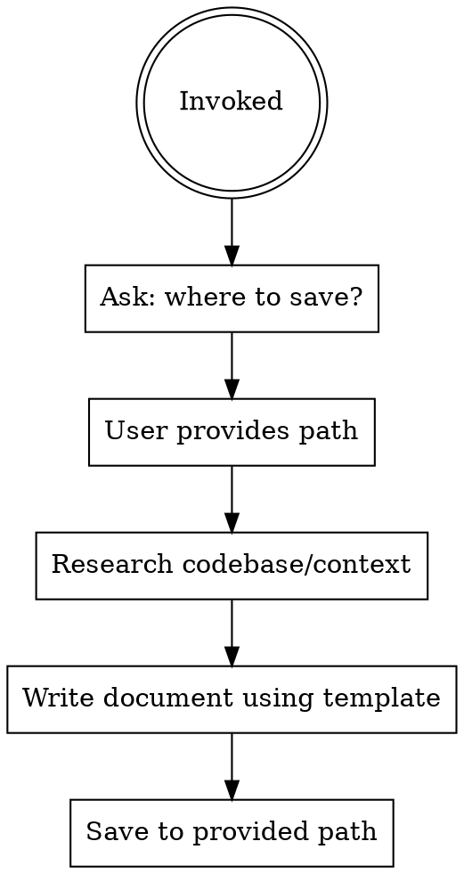

# Document Writer

## Overview

Write structured technical design documents following the standard template.
**Always ask for the output path before writing anything.**

## Workflow

## Step 1 — Ask for Path (REQUIRED)

Before any research or writing, ask:

> "Where should I save this document? (e.g. `docs/my-feature/index.md`)"

**Do not proceed until the user provides a path.**

## Step 2 — Research

Explore the relevant code, PRs, configs, and context needed to fill every section of the template.

## Step 3 — Write

Use the template at `TEMPLATE.md`. Fill every section — do not leave placeholder text. If a section genuinely does not apply, write "N/A" with a one-line explanation.

## Step 4 — Save

Write the completed document to the user-provided path.

## Rules

- Owner field: use the actual engineer's name/email if known, otherwise `@engineer`
- Status: always start as `Draft`
- Diagrams: use ASCII/Mermaid/sequence diagrams where possible
- Do not invent facts — research the code first
- Template file must not be modified
- If drawing diagrams, MUST use Mermaid syntax for consistency and future renderability
